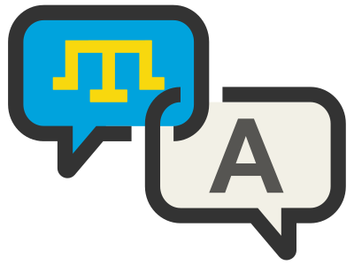

# Редактор текстов для построчной синхронизации переводов

## Установка для локальной разработки
`npm i`

## Деплой (в gh-pages)
`npm run deploy`

## Демо на gh-pages
https://el-shadow.github.io/synceditor/
